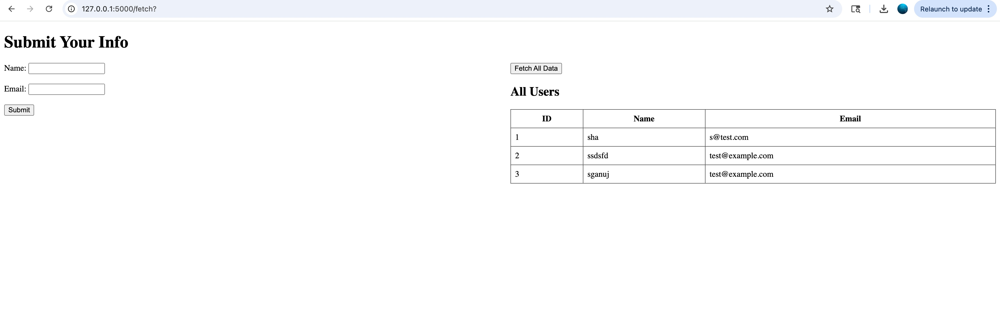

# Flask + MySQL with Docker Compose


This project demonstrates a simple Flask web application with a MySQL backend, orchestrated using Docker Compose.

## Features
- Submit user data (name, email) via a web form
- Store submissions in a MySQL database
- Fetch and display all users in a table

## Getting Started

### Prerequisites
- Docker
- Docker Compose

### Setup & Run
1. Clone this repository:
   ```sh
   git clone <your-repo-url>
   cd getting-started-wtth-lima
   ```
2. Build and start the services:
   ```sh
   docker-compose up --build
   ```
3. Visit [http://localhost:5000](http://localhost:5000) in your browser.



### Usage
- Fill out the form and submit to save data to MySQL.
- Click "Fetch All Data" to view all users in the database.

## Project Structure
```
├── docker-compose.yml
├── flask_app
│   ├── app.py
│   ├── requirements.txt
│   ├── Dockerfile
│   └── templates
│       └── form.html
```

## Environment Variables
MySQL credentials are set in `docker-compose.yml`:
- `MYSQL_ROOT_PASSWORD`: example_root_password
- `MYSQL_DATABASE`: example_db
- `MYSQL_USER`: example_user
- `MYSQL_PASSWORD`: example_password

Update these as needed for your use case.

## Stopping the App
```sh
docker-compose down
```

## License
MIT

